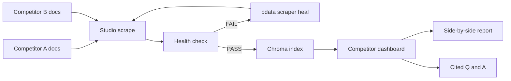
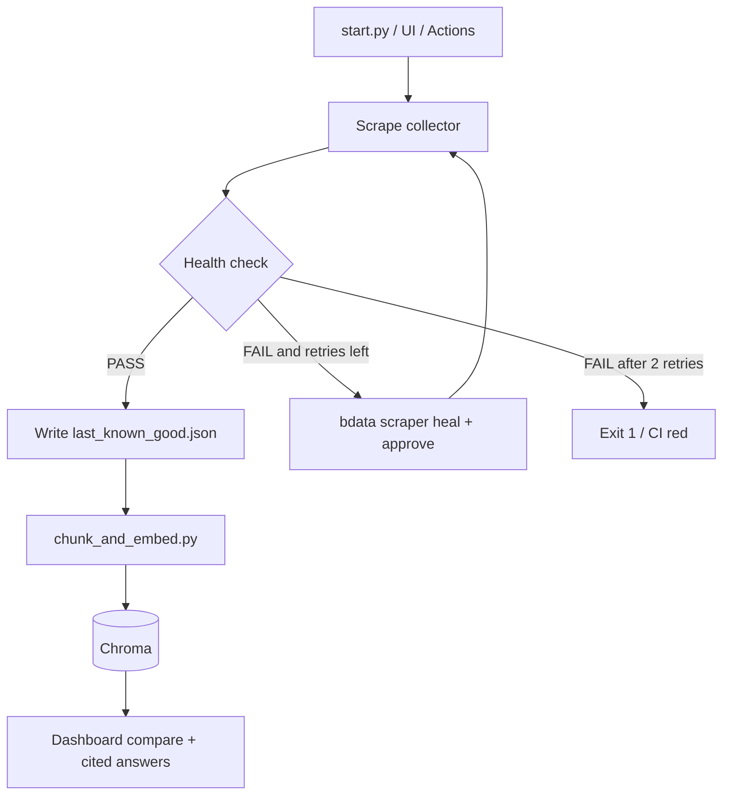
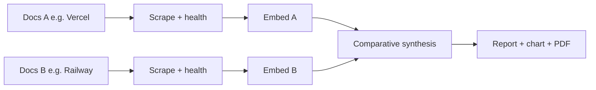
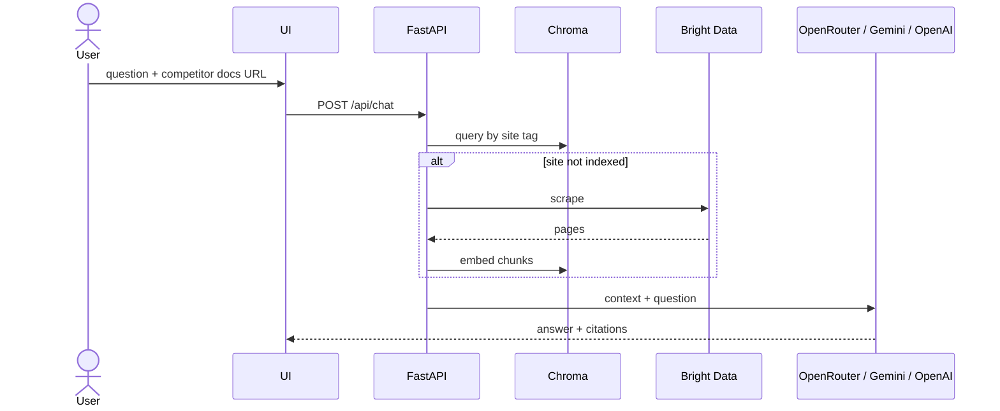
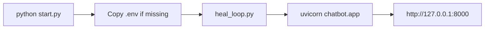
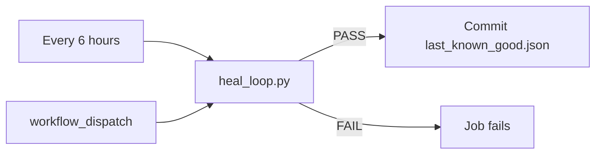

<div align="center">


# Competitor Dashboard

**Watch the companies that sell the same thing you do — and see where they are winning.**

[](#quick-start)
[](https://brightdata.com)
[](https://www.trychroma.com)
[](#http-api)
[](#license)

`scrape both sides` → `heal if the DOM moved` → `index` → `compare` → `ask`

[Features](#features) · [Quick Start](#quick-start) · [Workflow](#workflow) · [Demo](#demo) · [API](#http-api) · [CI](#github-actions)

</div>

Vercel and Railway both sell deployment. Supabase and Firebase both sell backend. The docs move every week. A product team should not learn that from a tweet.

This repo is a **competitor dashboard**: paste two public docs URLs from rivals in the same category, scrape them with Bright Data Scraper Studio, and get a live side-by-side report — coverage chart, trade-offs, citations, Markdown / PDF export. Then ask the indexed docs questions like an analyst, not a search box.

**Self-healing RAG is the engine, not the product.** When a competitor ships a new layout and the extract comes back empty, we do not patch a CSS selector in Python. We call a real `bdata scraper heal` on collector [`c_mt2z0drp1irsde3ydk`](https://brightdata.com/cp/scrapers/c_mt2z0drp1irsde3ydk), re-run, re-index Chroma, and the dashboard keeps comparing with fresh citations.

---

## Who it is for

Product, growth, and docs teams at companies that share a category with named rivals. Example pairings:

| You sell | Watch |
| --- | --- |
| Deployment | [Vercel docs](https://vercel.com/docs) vs [Railway docs](https://docs.railway.com) |
| Analytics DB | [DuckDB](https://duckdb.org/docs/) vs [ClickHouse](https://clickhouse.com/docs/) |
| App framework | any two public docs URLs you paste |

---

## Features

<table>
<tr>
<td width="50%">

**Live competitor compare**  
Scrape two docs sites, embed both, then a side-by-side report: feature matrix, coverage radar, citations, Markdown / PDF export.

</td>
<td width="50%">

**Analyst Q&A (RAG)**  
Ask a concrete question against one competitor’s indexed docs. Answers come with source titles and URLs. Index first; live scrape only if that site is missing.

</td>
</tr>
<tr>
<td width="50%">

**Self-healing scrape (under the hood)**  
Health FAIL runs `bdata scraper heal` + approve, then a Studio re-run. `--mock-unhealthy` only breaks the first scrape so you can demo the loop.

</td>
<td width="50%">

**Ops sidebar**  
Collector, engine, chunks, last heal. Timeline polls Scrape → Health → Heal → Index.

</td>
</tr>
<tr>
<td width="50%">

**Studio-first CI**  
`SCRAPE_ALLOW_FALLBACK=0` by default. Actions re-scrapes every 6 hours so competitor baselines do not rot.

</td>
<td width="50%">

**One command**  
`python start.py` copies `.env`, runs the heal loop, starts FastAPI, opens the browser. Windows: `run.bat` / `run.ps1`.

</td>
</tr>
</table>

---

## Quick Start

**Need:** Python 3.10+, Node (for the Bright Data CLI), a [Bright Data](https://brightdata.com) collector, and an [OpenRouter](https://openrouter.ai) key (Gemini or OpenAI also work).

### 1. Install

```bash
git clone https://github.com/PARZIVAL7498/Web-Scraper-Self-Healing.git
cd Web-Scraper-Self-Healing
pip install -r requirements.txt
npm install -g @brightdata/cli
bdata login --api-key $BRIGHTDATA_API_KEY
```

### 2. Configure

```bash
cp .env.example .env
```

```env
BRIGHTDATA_API_KEY=your_api_key_here
BRIGHTDATA_COLLECTOR_ID=c_mt2z0drp1irsde3ydk
TARGET_URL=https://vercel.com/docs
OPENROUTER_API_KEY=your_openrouter_api_key_here
OPENROUTER_MODEL=openai/gpt-4o-mini
SCRAPE_ALLOW_FALLBACK=0
```

No collector yet?

```bash
bdata scraper create https://vercel.com/docs \
  "Extract url, title, and main documentation content" \
  --name competitor-dashboard-heal --pretty
```

Put the returned `c_*` id in `BRIGHTDATA_COLLECTOR_ID`.

### 3. Run

```bash
python start.py
```

Open [http://127.0.0.1:8000](http://127.0.0.1:8000). Go to **Live compare**, keep Vercel vs Railway (or swap any pair), run the report. Use **Ask the docs** when you want a cited answer from one side.

| Shortcut | Command |
| --- | --- |
| UI only | `python start.py --skip-heal` |
| Demo a broken scrape then heal | `python start.py --mock-unhealthy` |
| Windows | `.\run.ps1` or `run.bat` |
| Unit tests | `python -m unittest discover -s tests -v` |

---

## Workflow

### Product



### Heal loop (reliability layer)



Gates that fail a scrape: empty payload, a page under 30 characters, or a same-domain page-count collapse vs `data/last_known_good.json`. Unlocker/HTTP only if `SCRAPE_ALLOW_FALLBACK=1`.

The UI timeline is this loop. It polls `GET /api/heal-status` while `heal_loop.py` writes `data/heal_job_status.json`.

### Dual-URL compare



### Analyst Q&A



LLM order: OpenRouter → Gemini → OpenAI → local extract.

### Launch path



---

## Demo

Show the **dashboard first**, then prove the scrape still heals when a layout breaks.

1. Open [http://127.0.0.1:8000](http://127.0.0.1:8000).
2. Confirm the sidebar collector id (`c_mt2z0drp1irsde3ydk`).
3. **Live compare:** Vercel vs Railway (or any same-category pair) → report + chart + citations.
4. **Ask the docs:** one question on a single competitor URL; show citations.
5. Optional: **Break & self-heal** — empty first extract, then real `bdata scraper heal` → Index.

`--mock-unhealthy` empties the **first** scrape only. Heal, approve, and the retry are live Studio calls when `bdata` is on PATH and the collector is real.

```bash
python scripts/heal_loop.py --mock-unhealthy
```

90-second shot list: [`docs/DEMO_SCRIPT.md`](docs/DEMO_SCRIPT.md).

---

## Commands

| You want | Run |
| --- | --- |
| Full launch | `python start.py` |
| UI only | `python start.py --skip-heal` |
| Demo heal | `python start.py --mock-unhealthy` |
| Custom port | `python start.py --port 8080` |
| Loop only | `python scripts/heal_loop.py` |
| Loop, no `bdata` | `python scripts/heal_loop.py --mock` |
| One URL | `python scripts/run_scraper.py --url https://vercel.com/docs` |
| Health only | `python scripts/health_check.py` |
| Re-embed | `python scripts/chunk_and_embed.py` |

`start.py` also takes `--host`, `--no-reload`, `--no-browser`.

---

## Environment

| Variable | Required | What it does |
| --- | --- | --- |
| `BRIGHTDATA_API_KEY` | live Studio | login, scrape, heal |
| `BRIGHTDATA_COLLECTOR_ID` | yes | Scraper Studio `c_*` |
| `BRIGHTDATA_ZONE` | no | Unlocker zone (`cli_unlocker`) |
| `TARGET_URL` | no | default competitor docs URL |
| `SCRAPE_ALLOW_FALLBACK` | no | `0` Studio only · `1` emergency Unlocker/HTTP |
| `OPENROUTER_API_KEY` | recommended | primary LLM |
| `OPENROUTER_MODEL` | no | default `openai/gpt-4o-mini` |
| `GEMINI_API_KEY` | no | fallback LLM |
| `OPENAI_API_KEY` | no | fallback LLM |
| `PORT` | no | default `8000` |

---

## HTTP API

| Method | Path | What it does |
| --- | --- | --- |
| `GET` | `/` | dashboard UI (compare + Q&A) |
| `GET` | `/api/status` | chunks, baseline, collector, engine, LLM |
| `GET` | `/api/heal-status` | live heal phase for the timeline |
| `POST` | `/api/chat` | `{ query, url?, top_k? }` → answer + citations |
| `POST` | `/api/trigger-scrape` | `{ mock_unhealthy? }` starts the loop |
| `POST` | `/api/scrape-and-compare` | `{ url_a, url_b, topic? }` → report + scores |

---

## GitHub Actions

Two workflows:

| Workflow | When | What |
| --- | --- | --- |
| [`.github/workflows/ci.yml`](.github/workflows/ci.yml) | push / pull request | `compileall` on `start.py`, `chatbot/`, `scripts/` |
| [`.github/workflows/scrape-and-heal.yml`](.github/workflows/scrape-and-heal.yml) | every 6 hours + manual | scrape → health → heal → index → commit baseline |



**Secrets:** `BRIGHTDATA_API_KEY`, `BRIGHTDATA_COLLECTOR_ID`  
**Optional secrets:** `OPENROUTER_API_KEY`, `GEMINI_API_KEY`, `OPENAI_API_KEY`  
**Optional vars:** `TARGET_URL`, `BRIGHTDATA_ZONE`, `SCRAPE_ALLOW_FALLBACK`

Manual run can set `mock_mode` or `mock_unhealthy`. Scheduled runs require the Bright Data secrets.

---

## Project layout

```
.
├── start.py                         # env → heal loop → uvicorn
├── run.bat / run.ps1                # Windows launchers
├── chatbot/
│   ├── app.py                       # FastAPI: compare, RAG, heal status
│   ├── rag.py                       # answer synthesis
│   └── static/                      # dashboard UI
├── scripts/
│   ├── docs_urls.py                 # URL / brand / credential helpers
│   ├── html_extract.py              # HTML → prose
│   ├── run_scraper.py               # Studio-first scrape
│   ├── health_check.py              # empty / baseline gates
│   ├── heal_loop.py                 # scrape → check → heal → index
│   └── chunk_and_embed.py           # Chroma indexing
├── tests/                           # unittest discover -s tests
├── data/                            # scrapes, baseline, heal status, Chroma
├── docs/
│   ├── competition-dashboard-banner.jpg
│   └── DEMO_SCRIPT.md
└── .github/workflows/
    ├── ci.yml
    └── scrape-and-heal.yml
```

---

## License

MIT.
